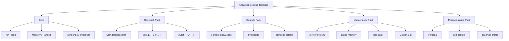

# Knowledge Nexus Template

Obsidian Vault を、複数 LLM エージェントが共有できる **外部記憶・作業引き継ぎ・知識コンパイル基盤** にするためのテンプレートです。

English: [README.md](README.md)

## これは何か

Knowledge Nexus Template は、Claude / Codex / Gemini などの LLM クライアントが同じ Vault を読み、同じプロトコルに従って作業できるようにするための構成テンプレートです。

チャット履歴に依存せず、以下をファイルとして分離します。

- 長期記憶: `Memory/INDEX.md`
- 短期引き継ぎ: `Handoff/CURRENT_CONTEXT.md`
- コマンド仕様: `CommandProtocol.md`
- 再利用可能な作業手順: `Workflows/`
- LLM が使いやすい compiled artifact

## 解決する課題

LLM を継続利用していると、次の問題が起きます。

- セッションが変わると文脈が消える
- Claude / Codex / Gemini で作業状態が分断される
- 生ドキュメントを毎回読ませるため、回答が不安定になる
- 調査結果や判断理由が散らばる
- 知識基盤が大きくなるほど劣化や矛盾に気づきにくい

Knowledge Nexus は、これらを Obsidian Vault 上の軽量なプロトコルとテンプレートで扱います。

## パック構成



| Pack | 役割 |
|---|---|
| Core | 起動、長期記憶、短期引き継ぎ、文脈圧縮 |
| Research Pack | 新しい情報を調査し、出典付きで統合する |
| Compile Pack | 既存知識を LLM-ready artifact に変換する |
| Maintenance Pack | Vault / Memory / Workflow の劣化を点検する |
| Personalization Pack | Persona や自己文脈を任意で追加する |

## 特徴

### 1. LLM 非依存の Vault レイヤー

Claude / Codex / Gemini など、LLM クライアントが変わっても、共有する記憶は Vault 側に置きます。

### 2. Memory と Handoff の分離

長期的に残すべき知識と、一時的な作業再開用メモを分けます。

### 3. Compile Pack

生ドキュメントを毎回 LLM に解釈させるのではなく、取り込み時に型・出典・構造を持つ artifact に変換します。

例:

```txt
raw notes x 3
  -> compiled decision guide
  -> future agents can retrieve the guide first
```

### 4. Maintenance Pack

知識基盤は必ず劣化する、という前提で `review-system`, `prune-memory`, `task-audit`, Golden Set を用意します。

## 使い方

まず Core だけを導入します。

```txt
templates/core/
```

その後、必要に応じて Pack を追加します。

```txt
templates/packs/research/
templates/packs/compile/
templates/packs/maintenance/
templates/packs/personalization/
```

チュートリアル:

- [Tutorial 01: First Core Session](docs/tutorials/01-core-first-session.md)
- [Tutorial 03: Compile a Knowledge Artifact](docs/tutorials/03-compile-knowledge-artifact.md)
- [LLM Compatibility](docs/llm-compatibility.md)

## アーキテクチャの特徴

- Obsidian Vault を LLM の外部記憶レイヤーとして扱う
- 長期記憶、短期引き継ぎ、調査、知識コンパイル、保守を分離する
- Claude / Codex / Gemini など複数 LLM クライアントで同じ Vault を共有する
- 生ドキュメントを毎回読ませず、LLM-ready artifact に変換して再利用する
- 知識基盤の劣化を前提に、点検・整理・評価のワークフローを持つ
- 個人運用と汎用テンプレートを分け、必要な Pack だけを導入できる

## サンプル

Compile Pack の Before / After:

- [Compiled Artifact Example](examples/compiled-artifact/README.md)

## ライセンス

MIT
