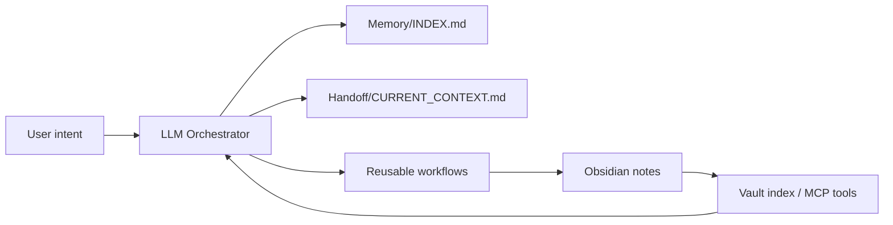

# Knowledge Nexus Template

An Obsidian-first memory and workflow layer for LLM agents.

Knowledge Nexus turns a local Obsidian vault into a shared operating context for
Claude, Codex, Gemini, and other LLM tools. It separates long-term memory,
short-term handoff, reusable workflows, and quality checks so agents can restart,
delegate, and audit work without relying on chat history alone.

## Start Small

This repository is packaged as profiles. Install only the layer you need.

| Profile | Use When | Includes |
|---|---|---|
| Core | You want persistent LLM memory and clean handoffs | `run/load`, `Memory/INDEX.md`, `condense`, `handoff`, MCP notes |
| Research Pack | You want source-backed multi-agent research | `StandardResearch`, agent roles, source-backed note template |
| Compile Pack | You want LLM-ready compiled knowledge artifacts | `compile-knowledge`, `synthesize`, compiled artifact templates |
| Maintenance Pack | Your vault is growing and needs hygiene | `review-system`, `prune-memory`, `task-audit`, quality golden set |
| Personalization Pack | You want custom persona and self-context | persona template, self-context template, observer profile |

## Repository Layout

```txt
docs/                         Conceptual docs and install guides
templates/core/               Minimal Knowledge Nexus runtime
templates/packs/research/     Optional research workflow pack
templates/packs/compile/      Optional knowledge compilation and synthesis pack
templates/packs/maintenance/  Optional maintenance and quality pack
templates/packs/personalization/
examples/                     Minimal and advanced vault examples
```

## Quick Install

1. Copy `templates/core/*` into the root of an Obsidian vault.
2. Open the vault with your LLM tool.
3. Say `run` or `load`.
4. Add packs only after the core loop works.

See [Getting Started](docs/getting-started.md) for the full walkthrough.

## Why Compile Knowledge?

Do not make the LLM reinterpret raw documents on every query. Stable knowledge
should be compiled once into typed, cited, reusable artifacts, then retrieved
progressively when needed.

## Core Idea



## What This Is Not

- Not a hosted app.
- Not a vector database requirement.
- Not tied to a single LLM vendor.
- Not a full personal knowledge system you must adopt all at once.

## Related Projects

- `nexus-vault-mcp`: optional MCP server for vault search/read/write.
- A private or dogfooding Nexus vault can keep personal workflows separate from this template.

## License

MIT.
