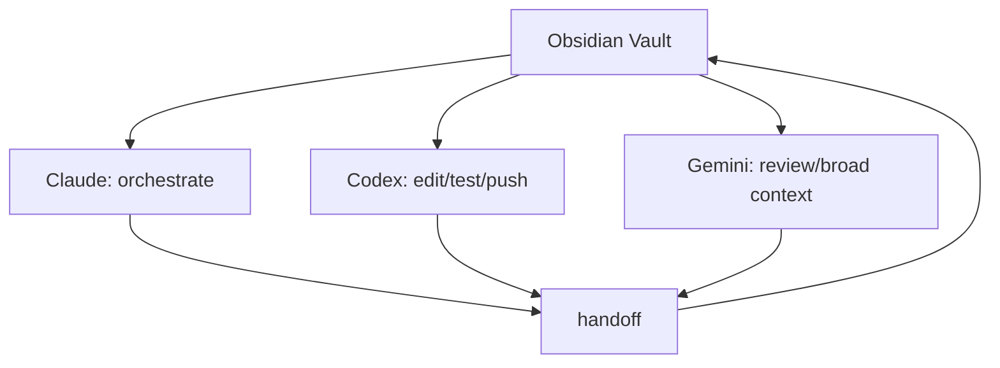

# LLM Compatibility

Knowledge Nexus is model-agnostic at the vault layer, but not behavior-identical
across LLM clients.

The shared source of truth is the vault:

- `SYSTEM_MANIFEST.md`
- `99_System/Memory/INDEX.md`
- `99_System/Handoff/CURRENT_CONTEXT.md`
- `99_System/Prompts/Protocols/`
- `99_System/Prompts/Workflows/`
- compiled notes and artifacts

Different LLMs can read the same files and follow the same protocols, but their
tooling, context windows, delegation behavior, and editing abilities differ.

## Recommended Roles

| LLM | Best Role | Good At | Watch Out For |
|---|---|---|---|
| Claude | Orchestrator | long-context synthesis, workflow routing, document design | may over-dispatch if not constrained |
| Codex | Builder / maintainer | repo edits, tests, GitHub work, implementation verification | subagent dispatch should require explicit workflow intent |
| Gemini | Broad-context reviewer | large context review, second opinion, Google ecosystem workflows | tool and dispatch behavior can vary by environment |

## Shared Commands

These should work across clients:

- `run` / `load`
- `condense`
- `handoff`
- `clear-handoff`
- `crystallize`

## Workflow Differences

### StandardResearch

Claude and Gemini can treat broad research requests as workflow candidates:

- "research this"
- "investigate"
- "tell me about..."

Codex should require explicit workflow intent before subagent dispatch:

- `StandardResearch`
- `research workflow`
- `investigation workflow`

Codex can still answer ordinary research questions directly when no workflow is
explicitly requested.

### CompileKnowledge

All three clients can run `compile-knowledge` because it is mostly file reading,
extraction, and structured writing. Claude may be strongest for deep synthesis;
Codex is strongest when artifacts need repo edits, tests, or commits.

### Maintenance

Codex is usually best for:

- file-by-file edits
- test updates
- Git commits and pushes
- mechanical repository restructuring

Claude is usually best for:

- deciding what should change
- reviewing protocol implications
- writing high-level documentation

## Practical Operating Pattern

Use the vault as shared memory. Use `handoff` when switching clients.

## Portability Rule

Do not rely on one model's hidden chat memory. If a future agent needs it, write
it to the vault through `handoff`, `crystallize`, or a compiled artifact.
